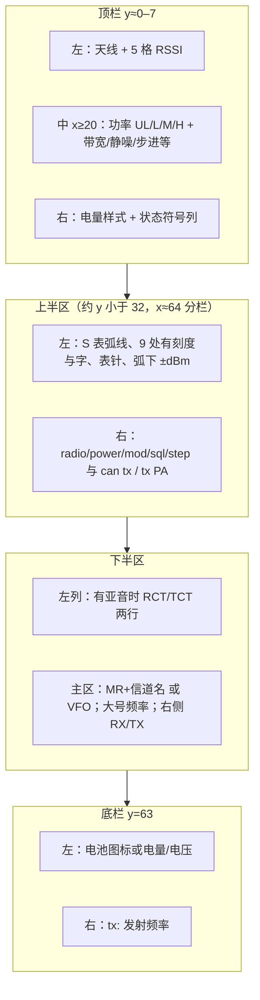

# hawk5

ARM 固件项目；主界面为 **VFO/信道应用**（代码中 `APP_VFO1`，应用列表显示为 **「1 vfo app」**）。关于页显示 **hawk5 v1.0**。

## 构建 (Building)

```bash
git clone <repo_url>
cd hawk5
make
```

## 烧录 (Flashing)

使用 k5prog 等工具烧录 `bin/firmware.bin`。

---

## 主界面（VFO）界面说明

以下为与当前 `src/apps/vfo1.c`、`src/ui/statusline.c` 绘制逻辑一致的布局说明。

### 布局示意图


### 结构（Mermaid）



### 顶栏

| 区域 | 说明 |
|------|------|
| 左 | 天线符号 + **5 格** RSSI 柱（`RSSI_MIN`～`RSSI_MAX` 线性映射为 1～5 格） |
| 中（`textLeft = 20` 起） | **功率**（UL/L/M/H）；同频时画 **直频竖线 \|→\|**；其后为 `STATUSLINE` 文案：**带宽（若有）**、**静噪类型/值**、**步进** 等（由 `STATUSLINE_RenderRadioSettings` 设置） |
| 右 | 按固定槽宽排列的 **状态图标**（如 EEPROM 写入、Loot 满、监听、广播、上变频、按键锁等） |

数字选信道时，顶栏可出现 **「Select: …」**（`gIsNumNavInput`）。

### 上半区左：S 表（`vfo1RenderUpperSmeter`）

- **半圆弧线** + **表针**；RSSI 在整段弧上 **线性** 对应角度（弱≈S 侧，强≈+6 侧）。
- 量程逻辑上为 **S → 1～9 → +1～+6** 共 16 档等分；**仅在有标签的 9 个角度**绘制主刻度线：**S、1、3、5、7、9、+2、4、6**（「+2」档刻线更长）；**不画**无字档与中间小刻度。
- 弧下方居中：**±dBm** 场强数值。

### 上半区右（`vfo1RenderUpperRight`）

TomThumb 多行，冒号与数值间距 **2px**，整块相对较早版本 **左移 2px**：

- `radio:` `power:` `mod:`
- `sql:` + 静噪类型 + 静噪值  
- `step:`  
- 底部一行：**can**、**tx:**、是否允许发射、**tx:**、PA **on/off**

信道数字输入时，本区可显示 **右对齐 `CH:` + 输入串**。

### 下半区（`vfo1RenderLower`）

| 区域 | 说明 |
|------|------|
| 左列 `x=2` | 有亚音时 **RCT / TCT**（或 RDCS/TDCS 等）小字两行 |
| 主列 | **信道模式**：`MR` + 三位信道号 + **信道名**；**VFO 模式**：`VFO` |
| 大频率 | `MHz` 主数字 + 小数部分；分数行右侧可显示 **RX** / **TX** |
| 监听模式 | 可改为 **RSSI 条** + 底栏（见下） |

### 底栏（`vfo1RenderBottomBar`，`y = 63`）

| 区域 | 说明 |
|------|------|
| 左 | 依设置：**电池图标** / **电量 %** / **电压**；Type-C 充电时可能显示 **+** |
| 右 | **`tx:`** + 发射频率字符串 |

> 说明：当前主界面 **无** 独立「分:秒」计时行；若文档旧版曾描述该条，以固件为准。

---

## 操作说明

### 按键定义

| 按键 | 短按 | 长按 |
|------|------|------|
| **Menu** | 进入 **运行应用** 列表 | 进入 **设置** |
| **Exit** | 退出当前应用/返回；监听中则关监听 | — |
| **↑ / ↓** | 信道模式换信道；VFO 模式按步进调频 | — |
| **0～9** | **0**：寄存器/参数小菜单；**1～9**：VFO 下进入频率输入；**信道模式**下数字选信道 | 见下表 |
| **# (F)** | 信道配置 CH cfg | **按键锁** |
| **\* (Star)** | Loot 列表 | — |
| **PTT** | 按住发射 | — |
| **侧键 1** | 监听 | 频谱/单位切换（与侧键 2 反向） |
| **侧键 2** | 手电筒 | 同上 |

**主界面数字键长按：**

| 按键 | 功能 |
|------|------|
| 1 | 信道列表（波段过滤） |
| 3 | VFO ↔ 信道 |
| 6 | 功率 + |
| 0 | 调制 + |

**信道模式数字选信道：** 短按数字进入输入，顶栏 **Select:**；**Menu** 或 **PTT** 确认；**Exit** 退格或取消。

---

### 主菜单（Menu 短按）— 运行应用

↑/↓ 选择，**Menu** 进入，**Exit** 返回。名称来自 `apps[]`（与下表一致）。

| 应用名（固件字符串） | 含义 |
|---------------------|------|
| 1 vfo app | 主 VFO/信道界面 |
| Channels | 信道列表 |
| FC | 频率计 |
| Spectrum | 频谱 |
| CH Scan | 信道扫描 |
| Band Scan | 波段扫描 |
| ABOUT | 关于 |

---

### 设置菜单（Menu 长按）

↑/↓ 选择，**Menu** 进入/确认，**Exit** 返回；数值项常用 **\*** / **#** 调整。

| 主项 | 内容概要 |
|------|----------|
| Scan | SQL 时间、FC/Listen/Stay/Skip 等 |
| Radio | DTMF、滤波、SI、STE、Roger、Multiwatch、Mic、频偏等 |
| Display | 对比度、背光、CH display、VFO 电平表等 |
| Battery | 电池类型、样式、校准 |
| Beep | 按键音 |
| Main app | 开机默认应用 |
| Lock PTT | PTT 锁 |

---

### 寄存器/参数小菜单（主界面短按 0）

↑/↓ 选参数，\*/# 调值，**Exit** 或再按 **0** 关闭。

---

*界面与操作随固件更新，以实际显示为准。*
